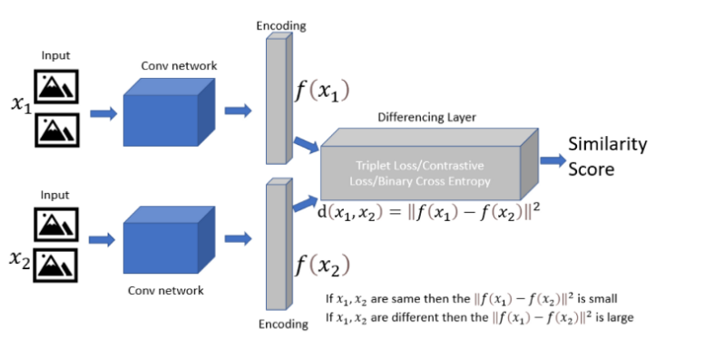
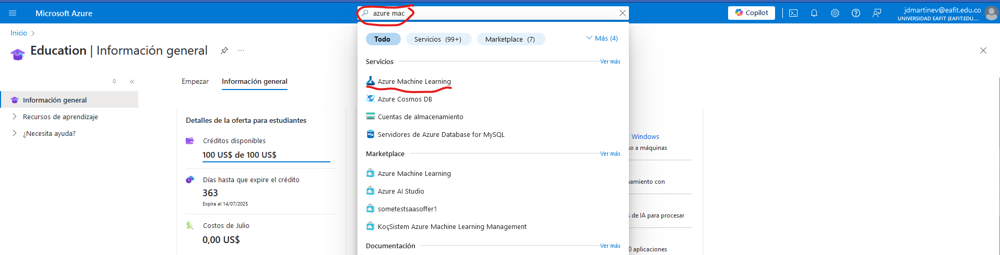
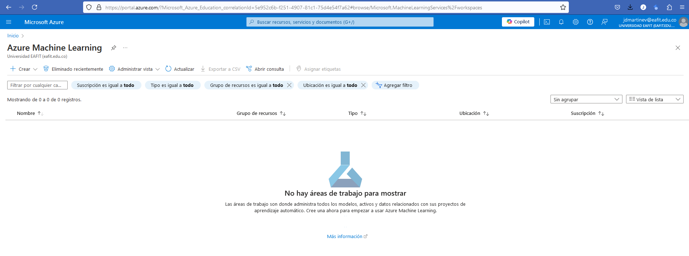

# Azure Machine Learning: Exploring papers with code

In this tutorial, we will try to replicate the experiments in the following paper:

https://www.cs.cmu.edu/~rsalakhu/papers/oneshot1.pdf

We will follow the steps to replicate the experimnts using the Azure Machine Learning Workspace, however, the same instructions apply to almost all the development ecosystems that we consider in the course.

So, first create an account in [Azure for students](https://azure.microsoft.com/es-es/free/students/?WT.mc_id=academic-77998-cacaste) using you @eafit.edu.co account

## 1. Siamese Neural Networks (just for fun)

We will get the code from the following page:
https://github.com/CloudAdvocacy/Siamese-Networks-for-One-Shot-Learning

A good source for finding papers with code is:
https://paperswithcode.com/paper/siamese-neural-networks-for-one-shot-image

What can we find in this repo:

- Script to train / evaluate the model
- Script to perform Bayesian hyperparameter optimization
- Omniglot dataset

- Modified training script
- Files to use scripts on Azure ML Inside AML directory

## 2. Azure ML studio

Once you have created the Azure for students account, go to the Azure ML studio:

