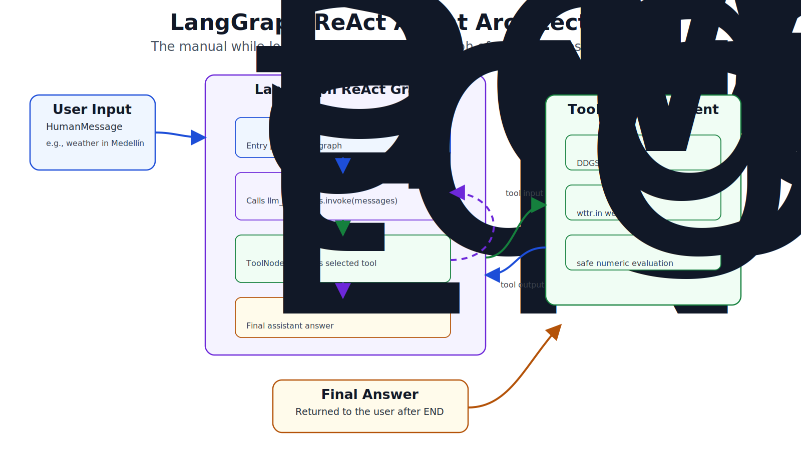
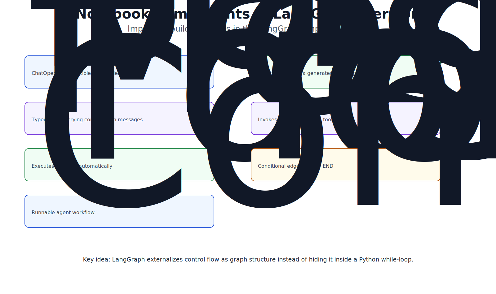
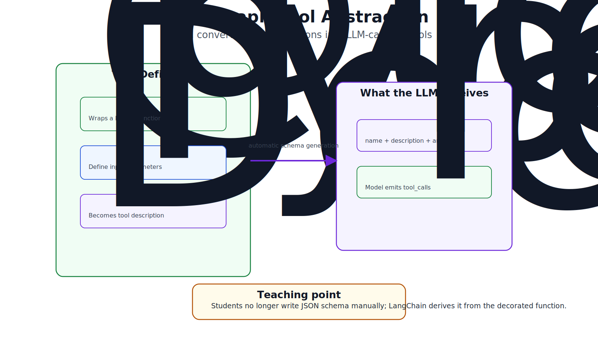
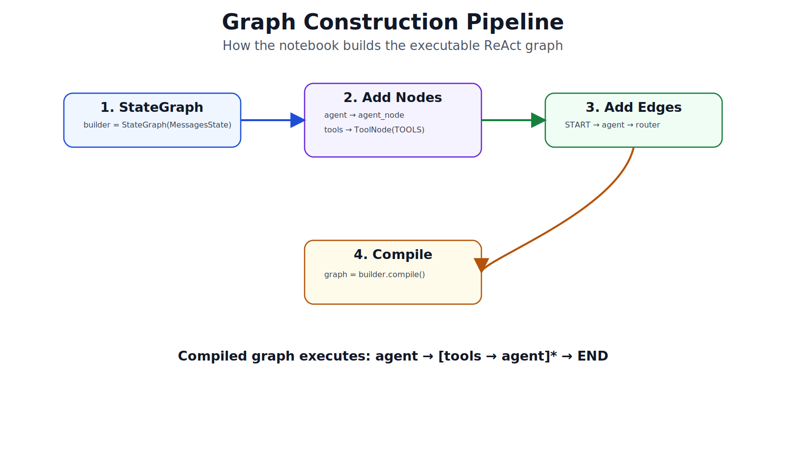
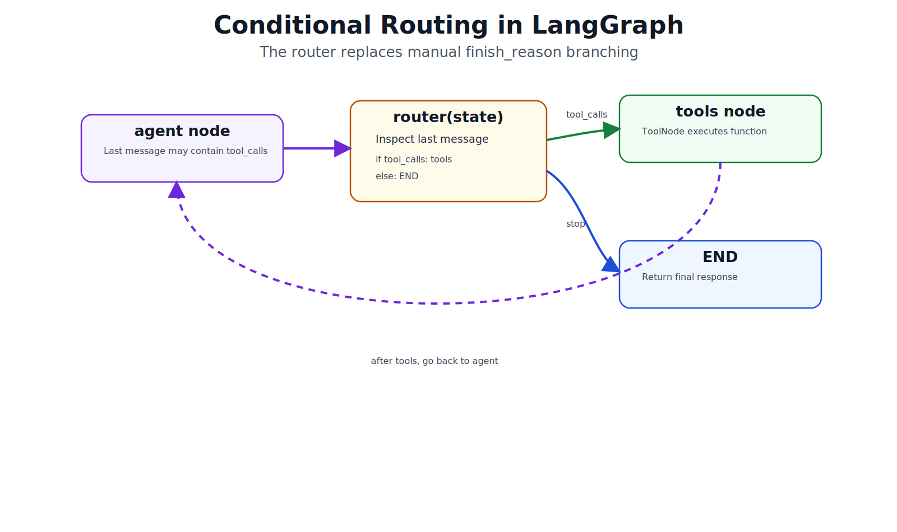
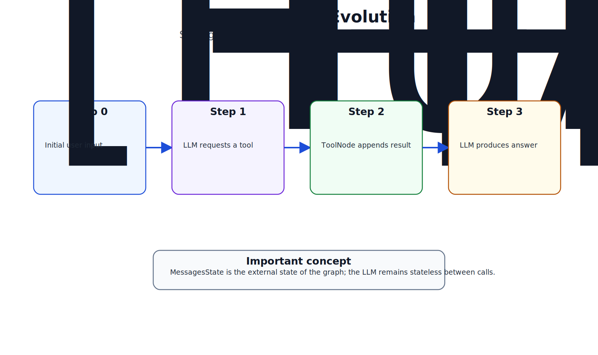
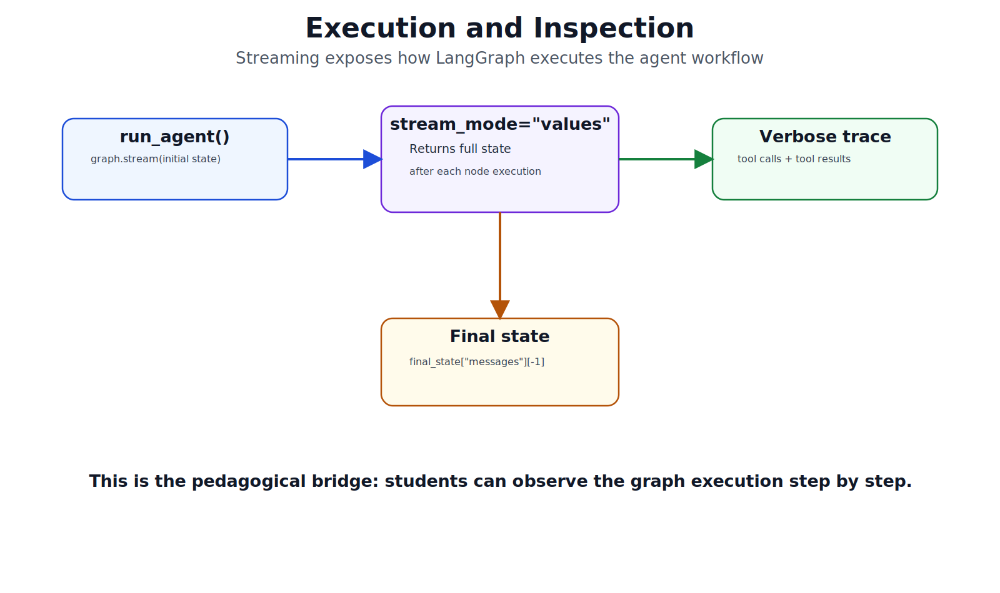

# Del Loop Manual a LangGraph: el mismo agente, otra arquitectura

> En el notebook anterior construiste el agentic loop **a mano**: un `for`, un `if finish_reason`, `messages.append(...)`.
> En este recorrido reescribes **exactamente el mismo agente** usando LangGraph.
> Las herramientas son idénticas — solo cambia cómo se orquesta el loop.
>
> **7 figuras · lectura ~10 min**

---

## Contenido

1. [Arquitectura ReAct en LangGraph](#1-arquitectura-react-en-langgraph)
2. [Componentes del notebook](#2-componentes-del-notebook)
3. [Abstracción de herramientas con `@tool`](#3-abstracción-de-herramientas-con-tool)
4. [Construcción del grafo](#4-construcción-del-grafo)
5. [Routing y conditional edges](#5-routing-y-conditional-edges)
6. [MessagesState: el estado del grafo](#6-messagesstate-el-estado-del-grafo)
7. [Streaming e inspección](#7-streaming-e-inspección)
8. [Resumen: part01 vs part02](#resumen-part01-vs-part02)

---

## 1. Arquitectura ReAct en LangGraph

En `part01` el agente era un `while` loop con tres bloques de código: llamar al LLM, chequear `finish_reason`, ejecutar tools. LangGraph convierte esa lógica en un **grafo explícito** con nodos, edges y estado.

El patrón se llama **ReAct** (Reasoning + Acting): el modelo razona, decide actuar llamando una herramienta, observa el resultado, y vuelve a razonar. LangGraph modela exactamente ese ciclo como un grafo con dos nodos (`agent` y `tools`) y un edge condicional que decide si continuar o terminar.



> **Lo que cambia:** el loop deja de ser código imperativo y se convierte en una estructura declarativa. Cada nodo hace una sola cosa; la lógica de control queda en los edges.

---

## 2. Componentes del notebook

Antes de construir el grafo, conviene mapear cada pieza del notebook a su rol en el sistema. Son siete componentes que trabajan juntos:

- **`ChatOpenAI`** — el cliente LLM, compatible con cualquier backend del `CONFIGS` dict de `part01`
- **`@tool`** — decorador que convierte una función Python en una herramienta LLM-callable
- **`MessagesState`** — el estado tipado que lleva la lista de mensajes entre nodos
- **`agent_node`** — el nodo que invoca al LLM con el historial completo
- **`ToolNode`** — el nodo que ejecuta las tool calls emitidas por el modelo
- **`router`** — la función que decide el siguiente nodo: `tools` o `END`
- **`graph`** — el `StateGraph` compilado, el agente ejecutable



> **Nota pedagógica:** en `part01` estos siete componentes estaban mezclados dentro de `run_agent()`. LangGraph los separa y los nombra — eso facilita entender, debuggear y extender el sistema.

---

## 3. Abstracción de herramientas con `@tool`

En `part01` cada herramienta requería dos cosas por separado: la función Python y un JSON schema escrito a mano. Con el decorador `@tool` de LangChain, el schema se genera **automáticamente** a partir del docstring y las type annotations.

```python
# part01 — schema manual (30+ líneas por herramienta)
def web_search(query: str) -> str:
    ...

TOOLS = [{"type": "function", "function": {"name": "web_search",
           "description": "...", "parameters": {...}}}]
TOOL_REGISTRY = {"web_search": web_search}

# part02 — @tool genera el schema solo
@tool
def web_search(query: str) -> str:
    """Busca información actualizada en la web."""
    ...

TOOLS = [web_search]   # el objeto es función + schema + nombre
```

El objeto resultante expone `.name`, `.description` y el JSON schema. `ToolNode` y `llm.bind_tools()` lo consumen directamente — sin `TOOL_REGISTRY` ni schemas manuales.



> **Lo que desaparece:** el `TOOL_REGISTRY` dict y los JSON schemas manuales. El decorador `@tool` hace ese trabajo inferiendo el schema desde el docstring y los tipos.

---

## 4. Construcción del grafo

El grafo se construye en cinco líneas. Cada línea corresponde a un concepto:

```python
builder = StateGraph(MessagesState)      # 1. declara el tipo de estado

builder.add_node("agent", agent_node)   # 2. nodo: llama al LLM
builder.add_node("tools", tool_node)    # 3. nodo: ejecuta herramientas

builder.add_edge(START, "agent")                    # 4. edges
builder.add_conditional_edges("agent", router)      #    router decide: tools | END
builder.add_edge("tools", "agent")                  #    después de tools, vuelve al agente

graph = builder.compile()               # 5. produce el agente ejecutable
```

`StateGraph(MessagesState)` le dice a LangGraph que el estado es una lista de mensajes. Eso es suficiente para que el framework gestione la acumulación del historial en cada iteración — sin `messages.append(...)` manual.



> **El ciclo está en los edges, no en el código.** `tools → agent` es la línea que reemplaza el `continue` del `for` loop de `part01`. La recursión termina cuando el router devuelve `END`.

---

## 5. Routing y conditional edges

El router es la pieza que reemplaza el `if finish_reason == "tool_calls"` de `part01`. Es una función Python ordinaria que recibe el estado y devuelve un string con el nombre del siguiente nodo.

```python
def router(state: MessagesState) -> Literal["tools", "__end__"]:
    last = state["messages"][-1]
    if hasattr(last, "tool_calls") and last.tool_calls:
        return "tools"
    return "__end__"
```

LangGraph registra esta función como un **conditional edge** desde el nodo `agent`. Después de cada llamada al LLM, el framework evalúa el router y enruta el flujo al nodo correspondiente.



> **Equivalencia exacta:**
>
> | `part01` | `part02` |
> |---|---|
> | `if finish_reason == "tool_calls"` | `router` devuelve `"tools"` |
> | `elif finish_reason == "stop": return text` | `router` devuelve `"__end__"` |
> | `else: break` | `recursion_limit` del grafo |

---

## 6. MessagesState: el estado del grafo

`MessagesState` es el tipo de estado que LangGraph pasa de nodo en nodo. Internamente es un `TypedDict` con una sola clave: `messages`, una lista que crece con cada iteración.

Cada nodo devuelve `{"messages": [nuevo_mensaje]}`. LangGraph **acumula** esos mensajes en la lista — no los reemplaza. Eso es exactamente lo que hacíamos con `messages.append(...)` en `part01`, pero ahora es automático.

La evolución del estado a través de una consulta de clima sigue este patrón:

| Iteración | Nodo ejecutado | Mensajes en estado |
|---|---|---|
| 0 | — | `[HumanMessage]` |
| 1 | `agent` | `[Human, AIMessage(tool_call)]` |
| 2 | `tools` | `[Human, AI, ToolMessage(resultado)]` |
| 3 | `agent` | `[Human, AI, Tool, AIMessage(respuesta final)]` |



> **El LLM sigue siendo stateless.** `MessagesState` no es memoria del modelo — es el historial completo que se envía en cada llamada. La "memoria" del agente sigue siendo esa lista, igual que en `part01`.

---

## 7. Streaming e inspección

LangGraph ofrece `graph.stream()` de forma nativa. Con `stream_mode="values"` el grafo emite el estado completo después de cada nodo, lo que permite ver tool calls y observaciones mientras ocurren — sin instrumentar el loop manualmente.

```python
for step in graph.stream(
    {"messages": [HumanMessage(content=query)]},
    stream_mode="values",
):
    last = step["messages"][-1]
    if isinstance(last, AIMessage) and last.tool_calls:
        print(f"🔧 {last.tool_calls[0]['name']}(...)")
    elif isinstance(last, ToolMessage):
        print(f"📥 {last.content[:100]}")
```

Para inspeccionar el historial completo al final, `graph.invoke()` devuelve el estado final con todos los mensajes:

```python
final_state = graph.invoke({"messages": [HumanMessage(content=query)]})
history = final_state["messages"]   # lista completa: system, user, AI, tool, AI...
```



> **Diferencia con `part01`:** en `run_agent_inspect` teníamos que instrumentar el loop a mano para ver el historial. Con LangGraph, el estado es siempre accesible — el framework lo gestiona.

---

## Resumen: part01 vs part02

| Aspecto | `part01` — from scratch | `part02` — LangGraph |
|---|---|---|
| **Loop** | `for iteration in range(10)` explícito | `StateGraph` con ciclo implícito |
| **Tools** | JSON schema manual + `TOOL_REGISTRY` dict | `@tool` genera schema; `ToolNode` ejecuta |
| **Estado** | `messages.append(...)` manual | `MessagesState` gestionado automáticamente |
| **Router** | `if finish_reason == "tool_calls"` | función `router` + `add_conditional_edges` |
| **Max iteraciones** | `range(1, 11)` | `graph.compile(recursion_limit=10)` |
| **Streaming** | No nativo | `graph.stream(...)` |
| **Visualización** | No | `graph.get_graph().draw_mermaid_png()` |
| **Extensibilidad** | Modificar el loop | Añadir nodos y edges |

### ¿Cuándo usar cada uno?

**`part01`** es ideal para entender los fundamentos y para agentes simples donde quieres control total y dependencias mínimas.

**`part02`** escala mejor: añadir memoria persistente, human-in-the-loop, subgrafos o agentes paralelos requiere cambios mínimos en la definición del grafo — sin reescribir el loop.

### Próximos pasos

En el siguiente notebook extenderemos este grafo para añadir **memoria persistente** entre conversaciones (`MemorySaver`) y **human-in-the-loop**: el agente pausa y pide confirmación antes de ejecutar una herramienta.

---

*Figuras generadas para el módulo de Agentes*
