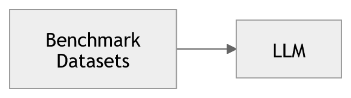
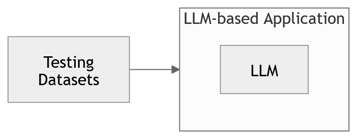
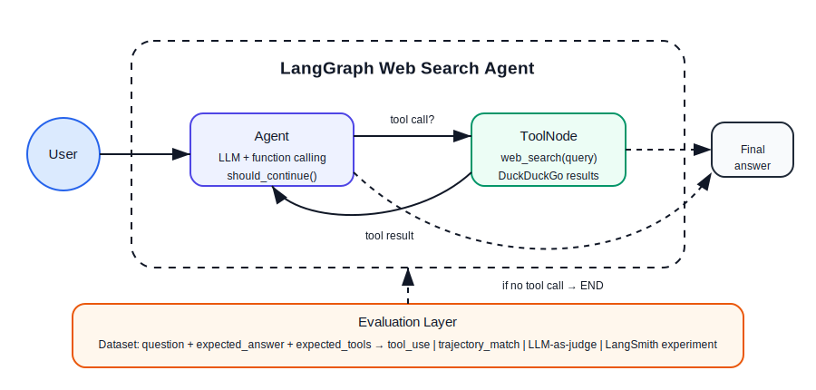
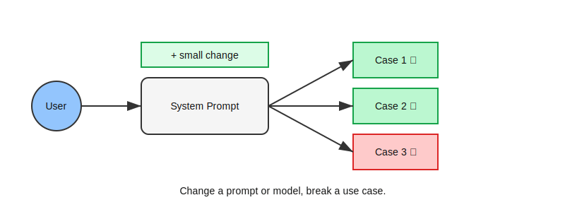

# Evaluación de modelos vs evaluación de sistemas

Los agentes de IA son aplicaciones de software impulsadas por modelos de lenguaje (LLMs). Sin embargo, evaluar este tipo de sistemas no es equivalente a evaluar software tradicional.

En términos generales, existen dos niveles de evaluación:

> **evaluación del modelo vs evaluación del sistema**

---

## Evaluación de modelos (LLM Model Evaluation)



**Figura 4.** Evaluación de modelos de lenguaje utilizando datasets de benchmark.

La evaluación de modelos se centra en medir qué tan bien un modelo de lenguaje realiza tareas específicas.

Se utilizan datasets estandarizados (*benchmarks*) para evaluar capacidades generales como:
- razonamiento  
- comprensión  
- generación de código  

Ejemplos comunes incluyen:
- **MMLU**: preguntas en múltiples dominios (matemáticas, medicina, filosofía, etc.)  
- **HumanEval**: generación de código  

Estos benchmarks son utilizados frecuentemente por proveedores para comparar modelos.

---

## Evaluación de sistemas (LLM System Evaluation)



**Figura 5.** Evaluación de una aplicación completa basada en LLMs.

En contraste, la evaluación de sistemas mide qué tan bien funciona una **aplicación completa**, donde el LLM es solo un componente.

Aquí se evalúa el sistema completo, incluyendo:
- prompts  
- herramientas  
- memoria  
- routing  
- lógica de negocio  

Los datasets utilizados pueden ser:
- creados manualmente  
- generados automáticamente  
- sintetizados  
- derivados de datos reales  

El objetivo es responder:
- ¿El sistema cumple con los requerimientos del usuario?
- ¿Funciona correctamente en escenarios reales?

---

## Software tradicional vs sistemas basados en LLM

En software tradicional, los sistemas son en gran medida **deterministas**.

Se pueden entender como:
> 🚆 un tren sobre rieles

- hay un inicio y un final claro  
- es fácil verificar si cada componente funciona  
- los resultados son reproducibles  

En este contexto:
- **unit tests** validan componentes individuales  
- **integration tests** validan el sistema completo  

---

En contraste, los sistemas basados en LLM son **no deterministas**.

Se pueden entender como:
> 🚗 conducir en una ciudad con tráfico

- el entorno es variable  
- el mismo input puede producir outputs diferentes  
- el comportamiento depende del contexto  

Esto implica que:
- no siempre es posible usar evaluaciones binarias (pass/fail)  
- se requieren métricas más cualitativas  

---

## Tipos comunes de evaluación en sistemas LLM

Algunos de los aspectos más importantes a evaluar incluyen:

- **Hallucination**  
  ¿El modelo inventa información o usa correctamente el contexto?

- **Retrieval relevance**  
  ¿Los documentos recuperados son relevantes?

- **Question answering accuracy**  
  ¿La respuesta coincide con el ground truth?

- **Toxicity**  
  ¿El output contiene lenguaje inapropiado o dañino?

- **Overall performance**  
  ¿El sistema cumple su objetivo?

Existen herramientas y datasets (incluyendo open-source) que permiten medir estos aspectos y diseñar evaluaciones personalizadas.

---

## Cuando pasamos a agentes

Cuando evolucionamos de una aplicación basada en LLM a un **agente**, la complejidad aumenta.

Un agente es:

> un sistema que utiliza un LLM para razonar y tomar acciones en nombre del usuario

---

### Componentes de un agente

Un agente típicamente incluye:

1. **Reasoning**  
   (razonamiento con el LLM)

2. **Routing**  
   (decidir qué herramienta usar)

3. **Action**  
   (ejecutar la herramienta, API o código)

---

## Ejemplo: Web Search Agent



**Figura 6.** Arquitectura del Web Search Agent implementado en `agent_evals.py`. El nodo `Agent` razona y decide si invocar `web_search` vía `should_continue()`. La capa de evaluación (naranja) opera sobre la trayectoria completa.

El agente que implementamos es un ejemplo concreto de este patrón. Dado un input del usuario, el LLM debe:

1. **Razonar**: ¿puedo responder desde mi conocimiento o necesito buscar?
2. **Rutear**: ¿invoco `web_search` o respondo directamente?
3. **Actuar**: ejecutar la búsqueda con DuckDuckGo
4. **Sintetizar**: generar una respuesta fundamentada en los resultados

---

## ¿Cómo evaluamos este agente?

Cada paso del proceso puede fallar de manera independiente:

| Paso | Falla posible | Evaluador |
|---|---|---|
| Routing | Llamó `web_search` cuando no era necesario | `tool_use` |
| Retrieval | Los resultados de búsqueda no son relevantes | `retrieval_quality` |
| Proceso | La secuencia de pasos no fue la esperada | `trajectory_match` |
| Síntesis | La respuesta final es incorrecta o incompleta | `llm_as_judge` |

Esta tabla muestra por qué evaluar solo la salida final es insuficiente. Un agente puede dar una respuesta correcta por razones equivocadas — por ejemplo, ignorando los resultados de búsqueda y respondiendo desde su conocimiento previo.

---

### Resultado que obtuvimos

Al evaluar el Web Search Agent con los cuatro evaluadores:

| Evaluador | Score | Interpretación |
|---|---|---|
| `tool_use` | 0.40 | El agente buscó en web cuando no era necesario (3 de 5 preguntas) |
| `retrieval_quality` | 0.84 | Cuando sí buscó, los resultados fueron mayormente relevantes |
| `trajectory_match` | 0.40 | El proceso no fue el esperado en las mismas 3 preguntas |
| `llm_as_judge` | 1.00 | Todas las respuestas finales fueron correctas |

> El agente es **correcto pero ineficiente**. El LLM-as-judge no detecta la ineficiencia porque evalúa si la trayectoria es *razonable*, no si es *óptima*. Para eso necesitamos los evaluadores determinísticos.

---

## Importancia de los datasets de evaluación

Pequeños cambios pueden generar efectos inesperados:



**Figura 7.** Cambios pequeños en el sistema (por ejemplo, modificar un prompt) pueden mejorar algunos casos mientras degradan otros. Este fenómeno se conoce como **regresión**.

Por ejemplo, si ajustamos el system prompt para que el agente no use `web_search` en preguntas de conocimiento general:
- el `tool_use` score mejora para esas preguntas  
- pero puede degradar la decisión de búsqueda en otros casos  

Por eso es fundamental tener un dataset de evaluación cubriendo **múltiples escenarios** antes de hacer cambios.

---

## Evaluación iterativa

Al igual que en software tradicional, el desarrollo de agentes requiere iteración:

```
Evaluar → Analizar resultados → Ajustar (prompt, tools, lógica) → Repetir
```

En nuestro caso concreto:

```
tool_use = 0.40  →  mejorar system prompt  →  volver a evaluar
```

Sin embargo, a diferencia del software clásico:
- el sistema es no determinista — el mismo prompt puede dar resultados distintos en ejecuciones diferentes
- puede mejorar en un caso y empeorar en otro

Esto hace que los **experimentos en LangSmith** sean especialmente útiles: permiten comparar versiones del agente sobre el mismo dataset y detectar regresiones.

---

## Observabilidad y trazas

Una práctica fundamental es recolectar **trazas (traces)** del comportamiento del agente.

En nuestro agente, la función `run_agent_and_get_trajectory` captura exactamente esto:

```python
{
  "answer": "Jensen Huang es el CEO de NVIDIA",
  "trajectory": [
    {"role": "user",      "content": "¿Quién es el CEO actual de NVIDIA?"},
    {"role": "assistant", "tool_calls": [{"function": {"name": "web_search", ...}}]},
    {"role": "tool",      "content": "Jensen Huang, CEO of NVIDIA..."},
    {"role": "assistant", "content": "Jensen Huang es el CEO de NVIDIA."}
  ],
  "tools_called": ["web_search"]
}
```

Esta traza permite:
- saber exactamente qué decidió el agente en cada paso  
- depurar errores a nivel de componente  
- alimentar los evaluadores de retrieval y trajectory  
- registrar experimentos reproducibles en LangSmith  

---

## Conclusión

Evaluar sistemas basados en LLM y agentes requiere un cambio de mentalidad:

- de evaluación determinista  
→ a evaluación probabilística  

- de caja negra  
→ a sistema observable  

- de evaluación final  
→ a evaluación por componentes y trayectoria  

En el Web Search Agent aplicamos este enfoque con cuatro evaluadores que cubren el routing, el retrieval, el proceso y la calidad final. Este mismo patrón escala a agentes más complejos con múltiples tools.

---

## ⏭️ Siguiente

➡️ [Evaluators: Deep dive](03-evaluators-deep-dive.md)

