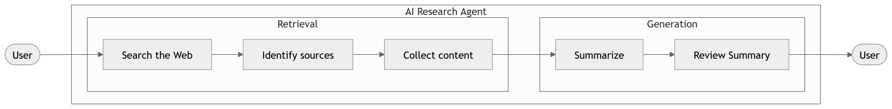
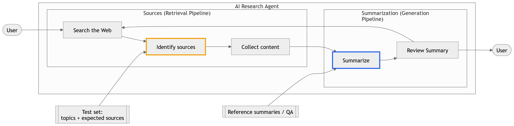

# Evaluación de Agentes de IA: de pipelines a sistemas observables

Los agentes de IA modernos no son funciones simples. Son **sistemas compuestos e iterativos** que combinan razonamiento, uso de herramientas y generación de lenguaje natural. En lugar de producir una salida en un solo paso, ejecutan ciclos donde planifican, actúan y refinan sus resultados.

Este cambio de paradigma introduce un reto fundamental:  
**¿cómo evaluamos correctamente un sistema que no es lineal ni monolítico?**

Adoptar un enfoque de *evaluation-driven development* permite abordar este problema de manera estructurada. En lugar de iterar de forma empírica (probar cambios sin saber su impacto), podemos analizar el comportamiento del agente paso a paso, identificar fallos y mejorar el sistema de forma dirigida.

---

## Arquitectura básica de un agente



**Figura 1.** Arquitectura básica de un agente con ciclo iterativo (*Plan → Tools → Reflect*). Este patrón permite que el agente refine su comportamiento mediante retroalimentación interna, incrementando la calidad de la solución a través de múltiples pasos.

Este ciclo introduce tres capacidades clave:
- **Planificación**: descomposición del problema  
- **Acción**: interacción con herramientas externas (APIs, código, bases de datos)  
- **Reflexión**: evaluación interna y corrección de errores  

Desde una perspectiva de evaluación, cada uno de estos componentes puede fallar de manera independiente.

---

## El problema de evaluar solo el resultado final

Una práctica común es evaluar únicamente la salida final del agente. Sin embargo, esto es insuficiente.

Supongamos que un agente genera un mal resultado. ¿Dónde está el error?
- ¿Falló el razonamiento inicial?
- ¿Seleccionó mal una herramienta?
- ¿Usó datos incorrectos?
- ¿O el problema está en la generación final?

Sin visibilidad interna, todas estas causas se mezclan. Esto dificulta la mejora sistemática del sistema.

Aquí es donde entra el concepto clásico de **análisis de errores**, adaptado a sistemas agénticos.

---

## Evaluación a nivel de componentes



**Figura 2.** Descomposición del agente en dos pipelines principales: *retrieval* (obtención de información) y *generation* (síntesis). Cada uno se evalúa con criterios distintos y datasets específicos.

En sistemas como agentes de investigación, podemos separar claramente dos etapas:

### 1. Retrieval (fuentes)
Incluye:
- Búsqueda
- Identificación de fuentes
- Recolección de contenido  

Este bloque puede evaluarse utilizando:
- Conjuntos de prueba con **fuentes esperadas**
- Métricas como:
  - Precision@k  
  - Recall@k  
  - nDCG  

### 2. Generation (síntesis)
Incluye:
- Resumen
- Revisión de la respuesta  

Este bloque se evalúa mediante:
- Métricas automáticas (ROUGE, BERTScore)
- Evaluación con modelos (*LLM-as-a-judge*)
- Validación basada en preguntas/respuestas (factualidad)

---

## Evaluar el proceso, no solo el resultado

Además del resultado final, es fundamental evaluar la **trayectoria del agente**:

- ¿El agente entra en bucles?
- ¿Repite pasos innecesarios?
- ¿Usa herramientas de forma eficiente?
- ¿Converge hacia una solución?

Esto introduce una dimensión adicional de evaluación:
> **calidad del proceso (trajectory evaluation)**

---

## Idea clave

> **Muchos errores en la salida final no son errores de generación, sino de recuperación de información.**

Esta distinción es crítica. Sin separar retrieval y generation:
- Se pueden optimizar componentes equivocados  
- Se pueden introducir cambios innecesarios  
- Se pierde eficiencia en el desarrollo  

---

## Conclusión

Evaluar agentes de IA requiere cambiar la forma en que pensamos los sistemas:

- De evaluación *end-to-end*  
→ a evaluación **factorizada por componentes**

- De prueba y error  
→ a **mejora guiada por métricas**

- De sistemas opacos  
→ a sistemas **observables e interpretables**

Este enfoque no solo mejora la calidad del agente, sino que permite escalar su desarrollo de manera controlada y reproducible.

---

## Caso de estudio: Web Search Agent


**Figura 3.** Arquitectura del agente implementado. El router (LLM) decide si invocar `web_search` o responder directamente desde su conocimiento, manteniendo el historial de mensajes como memoria implícita.

Hasta ahora hemos discutido cómo evaluar agentes de forma general. En esta sección aterrizamos estos conceptos en un sistema concreto que implementamos en `agent_evals.py`.

---

### ¿Qué hace este agente?

El agente recibe una pregunta del usuario y decide si puede responder desde su conocimiento o si necesita buscar información actualizada en la web.

```
Usuario → Agente (LLM) → ¿necesita buscar? 
                          SÍ → web_search (DDGS) → respuesta fundamentada
                          NO → respuesta directa
```

**Tool disponible:**

| Tool | Cuándo se usa |
|---|---|
| `web_search` | Preguntas sobre eventos recientes, personas, empresas, datos que cambian |

**Implementación en LangGraph:**

```python
graph_builder = StateGraph(AgentState)
graph_builder.add_node("agent", call_model)      # LLM decide
graph_builder.add_node("tools", ToolNode(TOOLS)) # ejecuta web_search
graph_builder.set_entry_point("agent")
graph_builder.add_conditional_edges("agent", should_continue)
graph_builder.add_edge("tools", "agent")         # vuelve al LLM con resultados
```

La función `should_continue` es el router: si el LLM genera `tool_calls` en su respuesta, el grafo va al nodo `tools`; si no, termina.

---

### Dataset de evaluación

El dataset contiene preguntas de dos tipos, diseñadas para probar si el agente sabe *cuándo* usar la tool:

| Tipo | Ejemplo | `expected_tools` | `expected_content` |
|---|---|---|---|
| Conocimiento general | ¿Cuántas lunas tiene Marte? | `[]` | — |
| Información actualizada | ¿Quién es el CEO actual de NVIDIA? | `["web_search"]` | `["Jensen Huang", "NVIDIA", "CEO"]` |
| Conocimiento general | ¿Cuál es la capital de Colombia? | `[]` | — |
| Información actualizada | ¿Cuándo fue fundada EAFIT? | `["web_search"]` | `["EAFIT", "1960", "Medellín"]` |
| Conocimiento general | ¿Cuál es la fórmula del agua? | `[]` | — |

El campo `expected_content` solo aplica a preguntas que usan `web_search` — define los términos clave que deben aparecer en los resultados de búsqueda para que el retrieval sea considerado exitoso.

Esta distinción es clave: un agente que siempre llama `web_search` puede dar respuestas correctas pero es **ineficiente**.

---

### Los tres evaluadores

#### 1. Tool use (determinístico)

Verifica si el agente llamó las tools correctas. No necesita LLM.

```python
evaluate_tool_use(tools_called=["web_search"], expected_tools=["web_search"])
# → {"score": 1.0, "comment": "✅ Llamó las tools correctas"}

evaluate_tool_use(tools_called=["web_search"], expected_tools=[])
# → {"score": 0.0, "comment": "❌ Llamó tools cuando no debía"}
```

**Cuándo usarlo:** cuando las tools correctas están claramente definidas en el dataset.

---

#### 2. Retrieval quality (determinístico)

Evalúa si los resultados de `web_search` contienen la información necesaria para responder la pregunta. Opera sobre los mensajes `role: tool` de la trayectoria.

```python
def evaluate_retrieval(trajectory: list, expected_content: list) -> dict:
    tool_results = " ".join(
        msg["content"] for msg in trajectory if msg["role"] == "tool"
    ).lower()

    if not tool_results:
        return {"score": 0.0, "comment": "❌ No se llamó ninguna tool"}

    found = [term for term in expected_content if term.lower() in tool_results]
    score = len(found) / len(expected_content)

    return {
        "score": score,
        "found": found,
        "missing": [t for t in expected_content if t not in found],
        "comment": f"✅ {len(found)}/{len(expected_content)} términos encontrados"
    }
```

Esta métrica es un **Recall@expected_content**: qué fracción de los términos esperados aparecieron en los resultados de búsqueda.

- `score = 1.0` → el retrieval trajo toda la información necesaria
- `score = 0.5` → trajo la mitad — la respuesta puede ser incompleta
- `score = 0.0` → no llamó la tool o los resultados son irrelevantes

**Cuándo usarlo:** para separar errores de retrieval de errores de generación. Si el retrieval score es bajo pero el LLM-as-judge es alto, el modelo está compensando con su conocimiento previo — lo cual es frágil.

---

#### 3. Trajectory match (agentevals)

Compara la secuencia de pasos del agente contra una trayectoria de referencia. Evalúa el **proceso**, no solo el resultado.

```python
trajectory_evaluator = create_trajectory_match_evaluator(
    trajectory_match_mode="subset",   # el agente debe llamar AL MENOS las tools esperadas
    tool_args_match_mode="ignore",    # no compara argumentos, solo nombres de tools
)
```

Modos disponibles:

| Modo | Cuándo usarlo |
|---|---|
| `strict` | Mismo orden y mismas tools |
| `unordered` | Mismas tools, cualquier orden |
| `subset` | El agente llamó al menos las tools esperadas |
| `superset` | El agente no llamó tools fuera de las esperadas |

---

#### 3. LLM-as-judge (agentevals)

Usa un LLM para juzgar si la trayectoria fue razonable. No necesita ground truth exacto.

En lugar de usar el prompt genérico de `agentevals`, implementamos un **juez multidimensional** con un prompt personalizado y salida estructurada con Pydantic:

```python
from pydantic import BaseModel

# Esquema Pydantic que fuerza al LLM a retornar JSON estructurado
class EvalScores(BaseModel):
    correctness: float   # ¿La respuesta es correcta?
    efficiency: float    # ¿Usó las tools mínimas necesarias?
    faithfulness: float  # ¿La respuesta viene de los resultados de búsqueda?
    comment: str         # Explicación del score

CUSTOM_EVAL_PROMPT = """You are an expert evaluator of AI agent trajectories.
Evaluate the following agent trajectory on THREE dimensions.

<Trajectory>
{outputs}
</Trajectory>

Score each dimension from 0.0 to 1.0:

1. **Correctness**: Is the final answer factually correct and complete?
   - 1.0: Correct and complete | 0.5: Partially correct | 0.0: Wrong or missing

2. **Efficiency**: Did the agent use the minimum tools necessary?
   - 1.0: Only called tools when truly needed
   - 0.5: Called some unnecessary tools
   - 0.0: Wrong tool usage pattern

3. **Faithfulness**: Is the final answer grounded in the tool results?
   - 1.0: Fully based on retrieved data
   - 0.5: Mixes retrieved data with assumptions
   - 0.0: Ignores tool results or hallucinates

Respond ONLY with JSON:
{{
  "correctness": <float 0.0-1.0>,
  "efficiency": <float 0.0-1.0>,
  "faithfulness": <float 0.0-1.0>,
  "comment": "<brief explanation>"
}}"""


def multidim_judge(trajectory: list) -> dict:
    # with_structured_output obliga al LLM a respetar el esquema Pydantic
    structured_judge = llm.with_structured_output(EvalScores)
    prompt = CUSTOM_EVAL_PROMPT.format(
        outputs=json.dumps(trajectory, indent=2, ensure_ascii=False)
    )
    result: EvalScores = structured_judge.invoke([HumanMessage(content=prompt)])
    return {
        "correctness": result.correctness,
        "efficiency": result.efficiency,
        "faithfulness": result.faithfulness,
        "comment": result.comment,
    }
```

`with_structured_output` garantiza que el LLM retorne siempre los tres scores como floats — sin necesidad de parsear texto libre ni manejar JSON mal formado.

Ejemplo de output:
```python
{
  "correctness": 1.0,
  "efficiency": 0.0,   # buscó en web para una pregunta de conocimiento general
  "faithfulness": 1.0,
  "comment": "Respuesta correcta pero innecesariamente buscó en web."
}
```

**Cuándo usarlo:** cuando no puedes definir una trayectoria de referencia perfecta, o cuando quieres evaluar dimensiones cualitativas que los evaluadores determinísticos no capturan.

---

### Resultados obtenidos

Al correr los cuatro evaluadores sobre el dataset de 5 preguntas:

**Evaluadores determinísticos:**

| Pregunta | tool_use | retrieval | trajectory |
|---|---|---|---|
| ¿Lunas de Marte? | 0.0 | — | 0.0 |
| ¿CEO de NVIDIA? | 1.0 | 1.0 | 1.0 |
| ¿Capital de Colombia? | 0.0 | — | 0.0 |
| ¿Fundación EAFIT? | 1.0 | 0.67 | 1.0 |
| ¿Fórmula del agua? | 0.0 | — | 0.0 |
| **Promedio** | **0.40** | **0.84** | **0.40** |

> El promedio de `retrieval` se calcula solo sobre las preguntas con `web_search` (n=2).

**LLM-as-judge (3 dimensiones):**

| Pregunta | correctness | efficiency | faithfulness |
|---|---|---|---|
| ¿Lunas de Marte? | 1.0 | 0.0 | 0.5 |
| ¿CEO de NVIDIA? | 1.0 | 1.0 | 1.0 |
| ¿Capital de Colombia? | 1.0 | 0.0 | 0.5 |
| ¿Fundación EAFIT? | 1.0 | 1.0 | 1.0 |
| ¿Fórmula del agua? | 1.0 | 0.0 | 0.5 |
| **Promedio** | **1.00** | **0.40** | **0.70** |

### Interpretación

Separar los evaluadores en dos tablas revela un patrón que una sola métrica no capturaría:

**Determinísticos:**
- `tool_use = 0.40` — el agente buscó en web para las 3 preguntas de conocimiento general
- `retrieval = 0.84` — cuando sí buscó, los resultados fueron mayormente relevantes
- `trajectory = 0.40` — el proceso no fue el esperado en esas mismas preguntas

**LLM-as-judge:**
- `correctness = 1.00` — todas las respuestas finales fueron correctas
- `efficiency = 0.40` — coincide exactamente con `tool_use`: el juez también detectó el uso innecesario de tools
- `faithfulness = 0.70` — en las preguntas donde buscó innecesariamente, el juez penalizó parcialmente porque la respuesta no estaba fundamentada en los resultados de búsqueda

> La coincidencia entre `tool_use` y `efficiency` es reveladora:  
> el evaluador determinístico y el LLM-as-judge llegaron a la misma conclusión por caminos distintos.  
> Cuando ambos coinciden, la evidencia es más sólida.

> `faithfulness = 0.5` en preguntas sin búsqueda indica que el agente respondió desde su conocimiento — correcto, pero no fundamentado en herramientas. Esto es aceptable aquí, pero sería un problema en dominios donde la frescura del dato importa.

**¿Cómo mejorar?** Ajustando el system prompt para que el agente no use `web_search` en preguntas de conocimiento general, y volviendo a evaluar — este es el ciclo de *evaluation-driven development*.

---

### Integración con LangSmith

Los mismos evaluadores se pueden registrar en LangSmith para tener un dashboard visual y experimentos reproducibles:

```python
experiment = client.evaluate(
    agent_target,
    data="agent-evals-demo",
    evaluators=[eval_tool_use, eval_retrieval, eval_trajectory, eval_llm_judge],
    experiment_prefix="llama-3.1-70b",
    max_concurrency=1,
)
```

Esto permite comparar distintas versiones del agente (diferentes modelos, diferentes system prompts) en el mismo dashboard.

---

### Lo que aprendemos evaluando este agente

| Componente evaluado | Evaluador | Pregunta que responde |
|---|---|---|
| Decisión de routing | `tool_use` | ¿Llamó las tools correctas? |
| Calidad del retrieval | `retrieval_quality` | ¿Los resultados de búsqueda son relevantes? |
| Secuencia de pasos | `trajectory_match` | ¿El proceso fue el esperado? |
| Calidad general | `llm_as_judge` | ¿La trayectoria fue razonable? |

Este agente es simple por diseño — una sola tool, preguntas factuales — para que el foco esté en entender los **evaluadores**, no en depurar el agente.

En el workshop aplicarás estos mismos patrones a un agente más complejo que tú mismo diseñarás.

---

## ⏭️ Siguiente

➡️ [Evaluación de modelos vs sistemas](02-model-vs-system.md)
# Evaluación de Agentes de IA: de pipelines a sistemas observables

Los agentes de IA modernos no son funciones simples. Son **sistemas compuestos e iterativos** que combinan razonamiento, uso de herramientas y generación de lenguaje natural. En lugar de producir una salida en un solo paso, ejecutan ciclos donde planifican, actúan y refinan sus resultados.

Este cambio de paradigma introduce un reto fundamental:  
**¿cómo evaluamos correctamente un sistema que no es lineal ni monolítico?**

Adoptar un enfoque de *evaluation-driven development* permite abordar este problema de manera estructurada. En lugar de iterar de forma empírica (probar cambios sin saber su impacto), podemos analizar el comportamiento del agente paso a paso, identificar fallos y mejorar el sistema de forma dirigida.

---

## Arquitectura básica de un agente


**Figura 1.** Arquitectura básica de un agente con ciclo iterativo (*Plan → Tools → Reflect*). Este patrón permite que el agente refine su comportamiento mediante retroalimentación interna, incrementando la calidad de la solución a través de múltiples pasos.

Este ciclo introduce tres capacidades clave:
- **Planificación**: descomposición del problema  
- **Acción**: interacción con herramientas externas (APIs, código, bases de datos)  
- **Reflexión**: evaluación interna y corrección de errores  

Desde una perspectiva de evaluación, cada uno de estos componentes puede fallar de manera independiente.

---

## El problema de evaluar solo el resultado final

Una práctica común es evaluar únicamente la salida final del agente. Sin embargo, esto es insuficiente.

Supongamos que un agente genera un mal resultado. ¿Dónde está el error?
- ¿Falló el razonamiento inicial?
- ¿Seleccionó mal una herramienta?
- ¿Usó datos incorrectos?
- ¿O el problema está en la generación final?

Sin visibilidad interna, todas estas causas se mezclan. Esto dificulta la mejora sistemática del sistema.

Aquí es donde entra el concepto clásico de **análisis de errores**, adaptado a sistemas agénticos.

---

## Evaluación a nivel de componentes


**Figura 2.** Descomposición del agente en dos pipelines principales: *retrieval* (obtención de información) y *generation* (síntesis). Cada uno se evalúa con criterios distintos y datasets específicos.

En sistemas como agentes de investigación, podemos separar claramente dos etapas:

### 1. Retrieval (fuentes)
Incluye:
- Búsqueda
- Identificación de fuentes
- Recolección de contenido  

Este bloque puede evaluarse utilizando:
- Conjuntos de prueba con **fuentes esperadas**
- Métricas como:
  - Precision@k  
  - Recall@k  
  - nDCG  

### 2. Generation (síntesis)
Incluye:
- Resumen
- Revisión de la respuesta  

Este bloque se evalúa mediante:
- Métricas automáticas (ROUGE, BERTScore)
- Evaluación con modelos (*LLM-as-a-judge*)
- Validación basada en preguntas/respuestas (factualidad)

---

## Evaluar el proceso, no solo el resultado

Además del resultado final, es fundamental evaluar la **trayectoria del agente**:

- ¿El agente entra en bucles?
- ¿Repite pasos innecesarios?
- ¿Usa herramientas de forma eficiente?
- ¿Converge hacia una solución?

Esto introduce una dimensión adicional de evaluación:
> **calidad del proceso (trajectory evaluation)**

---

## Idea clave

> **Muchos errores en la salida final no son errores de generación, sino de recuperación de información.**

Esta distinción es crítica. Sin separar retrieval y generation:
- Se pueden optimizar componentes equivocados  
- Se pueden introducir cambios innecesarios  
- Se pierde eficiencia en el desarrollo  

---

## Conclusión

Evaluar agentes de IA requiere cambiar la forma en que pensamos los sistemas:

- De evaluación *end-to-end*  
→ a evaluación **factorizada por componentes**

- De prueba y error  
→ a **mejora guiada por métricas**

- De sistemas opacos  
→ a sistemas **observables e interpretables**

Este enfoque no solo mejora la calidad del agente, sino que permite escalar su desarrollo de manera controlada y reproducible.

---

## Caso de estudio: Web Search Agent


**Figura 3.** Arquitectura del agente implementado. El router (LLM) decide si invocar `web_search` o responder directamente desde su conocimiento, manteniendo el historial de mensajes como memoria implícita.

Hasta ahora hemos discutido cómo evaluar agentes de forma general. En esta sección aterrizamos estos conceptos en un sistema concreto que implementamos en `agent_evals.py`.

---

### ¿Qué hace este agente?

El agente recibe una pregunta del usuario y decide si puede responder desde su conocimiento o si necesita buscar información actualizada en la web.

```
Usuario → Agente (LLM) → ¿necesita buscar? 
                          SÍ → web_search (DDGS) → respuesta fundamentada
                          NO → respuesta directa
```

**Tool disponible:**

| Tool | Cuándo se usa |
|---|---|
| `web_search` | Preguntas sobre eventos recientes, personas, empresas, datos que cambian |

**Implementación en LangGraph:**

```python
graph_builder = StateGraph(AgentState)
graph_builder.add_node("agent", call_model)      # LLM decide
graph_builder.add_node("tools", ToolNode(TOOLS)) # ejecuta web_search
graph_builder.set_entry_point("agent")
graph_builder.add_conditional_edges("agent", should_continue)
graph_builder.add_edge("tools", "agent")         # vuelve al LLM con resultados
```

La función `should_continue` es el router: si el LLM genera `tool_calls` en su respuesta, el grafo va al nodo `tools`; si no, termina.

---

### Dataset de evaluación

El dataset contiene preguntas de dos tipos, diseñadas para probar si el agente sabe *cuándo* usar la tool:

| Tipo | Ejemplo | `expected_tools` | `expected_content` |
|---|---|---|---|
| Conocimiento general | ¿Cuántas lunas tiene Marte? | `[]` | — |
| Información actualizada | ¿Quién es el CEO actual de NVIDIA? | `["web_search"]` | `["Jensen Huang", "NVIDIA", "CEO"]` |
| Conocimiento general | ¿Cuál es la capital de Colombia? | `[]` | — |
| Información actualizada | ¿Cuándo fue fundada EAFIT? | `["web_search"]` | `["EAFIT", "1960", "Medellín"]` |
| Conocimiento general | ¿Cuál es la fórmula del agua? | `[]` | — |

El campo `expected_content` solo aplica a preguntas que usan `web_search` — define los términos clave que deben aparecer en los resultados de búsqueda para que el retrieval sea considerado exitoso.

Esta distinción es clave: un agente que siempre llama `web_search` puede dar respuestas correctas pero es **ineficiente**.

---

### Los tres evaluadores

#### 1. Tool use (determinístico)

Verifica si el agente llamó las tools correctas. No necesita LLM.

```python
evaluate_tool_use(tools_called=["web_search"], expected_tools=["web_search"])
# → {"score": 1.0, "comment": "✅ Llamó las tools correctas"}

evaluate_tool_use(tools_called=["web_search"], expected_tools=[])
# → {"score": 0.0, "comment": "❌ Llamó tools cuando no debía"}
```

**Cuándo usarlo:** cuando las tools correctas están claramente definidas en el dataset.

---

#### 2. Retrieval quality (determinístico)

Evalúa si los resultados de `web_search` contienen la información necesaria para responder la pregunta. Opera sobre los mensajes `role: tool` de la trayectoria.

```python
def evaluate_retrieval(trajectory: list, expected_content: list) -> dict:
    tool_results = " ".join(
        msg["content"] for msg in trajectory if msg["role"] == "tool"
    ).lower()

    if not tool_results:
        return {"score": 0.0, "comment": "❌ No se llamó ninguna tool"}

    found = [term for term in expected_content if term.lower() in tool_results]
    score = len(found) / len(expected_content)

    return {
        "score": score,
        "found": found,
        "missing": [t for t in expected_content if t not in found],
        "comment": f"✅ {len(found)}/{len(expected_content)} términos encontrados"
    }
```

Esta métrica es un **Recall@expected_content**: qué fracción de los términos esperados aparecieron en los resultados de búsqueda.

- `score = 1.0` → el retrieval trajo toda la información necesaria
- `score = 0.5` → trajo la mitad — la respuesta puede ser incompleta
- `score = 0.0` → no llamó la tool o los resultados son irrelevantes

**Cuándo usarlo:** para separar errores de retrieval de errores de generación. Si el retrieval score es bajo pero el LLM-as-judge es alto, el modelo está compensando con su conocimiento previo — lo cual es frágil.

---

#### 3. Trajectory match (agentevals)

Compara la secuencia de pasos del agente contra una trayectoria de referencia. Evalúa el **proceso**, no solo el resultado.

```python
trajectory_evaluator = create_trajectory_match_evaluator(
    trajectory_match_mode="subset",   # el agente debe llamar AL MENOS las tools esperadas
    tool_args_match_mode="ignore",    # no compara argumentos, solo nombres de tools
)
```

Modos disponibles:

| Modo | Cuándo usarlo |
|---|---|
| `strict` | Mismo orden y mismas tools |
| `unordered` | Mismas tools, cualquier orden |
| `subset` | El agente llamó al menos las tools esperadas |
| `superset` | El agente no llamó tools fuera de las esperadas |

---

#### 3. LLM-as-judge (agentevals)

Usa un LLM para juzgar si la trayectoria fue razonable. No necesita ground truth exacto.

En lugar de usar el prompt genérico de `agentevals`, implementamos un **juez multidimensional** con un prompt personalizado y salida estructurada con Pydantic:

```python
from pydantic import BaseModel

# Esquema Pydantic que fuerza al LLM a retornar JSON estructurado
class EvalScores(BaseModel):
    correctness: float   # ¿La respuesta es correcta?
    efficiency: float    # ¿Usó las tools mínimas necesarias?
    faithfulness: float  # ¿La respuesta viene de los resultados de búsqueda?
    comment: str         # Explicación del score

CUSTOM_EVAL_PROMPT = """You are an expert evaluator of AI agent trajectories.
Evaluate the following agent trajectory on THREE dimensions.

<Trajectory>
{outputs}
</Trajectory>

Score each dimension from 0.0 to 1.0:

1. **Correctness**: Is the final answer factually correct and complete?
   - 1.0: Correct and complete | 0.5: Partially correct | 0.0: Wrong or missing

2. **Efficiency**: Did the agent use the minimum tools necessary?
   - 1.0: Only called tools when truly needed
   - 0.5: Called some unnecessary tools
   - 0.0: Wrong tool usage pattern

3. **Faithfulness**: Is the final answer grounded in the tool results?
   - 1.0: Fully based on retrieved data
   - 0.5: Mixes retrieved data with assumptions
   - 0.0: Ignores tool results or hallucinates

Respond ONLY with JSON:
{{
  "correctness": <float 0.0-1.0>,
  "efficiency": <float 0.0-1.0>,
  "faithfulness": <float 0.0-1.0>,
  "comment": "<brief explanation>"
}}"""


def multidim_judge(trajectory: list) -> dict:
    # with_structured_output obliga al LLM a respetar el esquema Pydantic
    structured_judge = llm.with_structured_output(EvalScores)
    prompt = CUSTOM_EVAL_PROMPT.format(
        outputs=json.dumps(trajectory, indent=2, ensure_ascii=False)
    )
    result: EvalScores = structured_judge.invoke([HumanMessage(content=prompt)])
    return {
        "correctness": result.correctness,
        "efficiency": result.efficiency,
        "faithfulness": result.faithfulness,
        "comment": result.comment,
    }
```

`with_structured_output` garantiza que el LLM retorne siempre los tres scores como floats — sin necesidad de parsear texto libre ni manejar JSON mal formado.

Ejemplo de output:
```python
{
  "correctness": 1.0,
  "efficiency": 0.0,   # buscó en web para una pregunta de conocimiento general
  "faithfulness": 1.0,
  "comment": "Respuesta correcta pero innecesariamente buscó en web."
}
```

**Cuándo usarlo:** cuando no puedes definir una trayectoria de referencia perfecta, o cuando quieres evaluar dimensiones cualitativas que los evaluadores determinísticos no capturan.

---

### Resultados obtenidos

Al correr los tres evaluadores sobre el dataset de 5 preguntas:

| Pregunta | tool_use | retrieval | trajectory | llm_judge |
|---|---|---|---|---|
| ¿Lunas de Marte? | 0.0 | — | False | True |
| ¿CEO de NVIDIA? | 1.0 | 1.0 | True | True |
| ¿Capital de Colombia? | 0.0 | — | False | True |
| ¿Fundación EAFIT? | 1.0 | 0.67 | True | True |
| ¿Fórmula del agua? | 0.0 | — | False | True |
| **Promedio** | **0.40** | **0.84** | **0.40** | **1.00** |

> El promedio de retrieval se calcula solo sobre las preguntas que requieren búsqueda (n=2).

### Interpretación

Estos resultados ilustran perfectamente la diferencia entre los evaluadores:

- **LLM-as-judge = 1.0** — el agente siempre dio respuestas correctas
- **Tool use = 0.40** — en las 3 preguntas de conocimiento general, el agente llamó `web_search` innecesariamente
- **Trajectory match = 0.40** — el proceso no fue el esperado en esas mismas preguntas
- **Retrieval = 0.84** — cuando sí buscó, los resultados fueron mayormente relevantes; la pregunta de EAFIT no encontró "Medellín" en los snippets

> Un agente puede tener respuestas correctas pero un proceso ineficiente.  
> El `llm_as_judge` evalúa si la trayectoria es *razonable*, no si es *óptima*.  
> Para detectar ineficiencia necesitas evaluadores determinísticos.

**¿Cómo mejorar?** Ajustando el system prompt para que el agente no use `web_search` en preguntas de conocimiento general, y volviendo a evaluar — este es el ciclo de *evaluation-driven development*.

---

### Integración con LangSmith

Los mismos evaluadores se pueden registrar en LangSmith para tener un dashboard visual y experimentos reproducibles:

```python
experiment = client.evaluate(
    agent_target,
    data="agent-evals-demo",
    evaluators=[eval_tool_use, eval_retrieval, eval_trajectory, eval_llm_judge],
    experiment_prefix="llama-3.1-70b",
    max_concurrency=1,
)
```

Esto permite comparar distintas versiones del agente (diferentes modelos, diferentes system prompts) en el mismo dashboard.

---

### Lo que aprendemos evaluando este agente

| Componente evaluado | Evaluador | Pregunta que responde |
|---|---|---|
| Decisión de routing | `tool_use` | ¿Llamó las tools correctas? |
| Calidad del retrieval | `retrieval_quality` | ¿Los resultados de búsqueda son relevantes? |
| Secuencia de pasos | `trajectory_match` | ¿El proceso fue el esperado? |
| Calidad general | `llm_as_judge` | ¿La trayectoria fue razonable? |

Este agente es simple por diseño — una sola tool, preguntas factuales — para que el foco esté en entender los **evaluadores**, no en depurar el agente.

En el workshop aplicarás estos mismos patrones a un agente más complejo que tú mismo diseñarás.

---

## ⏭️ Siguiente

➡️ [Evaluación de modelos vs sistemas](02-model-vs-system.md)
