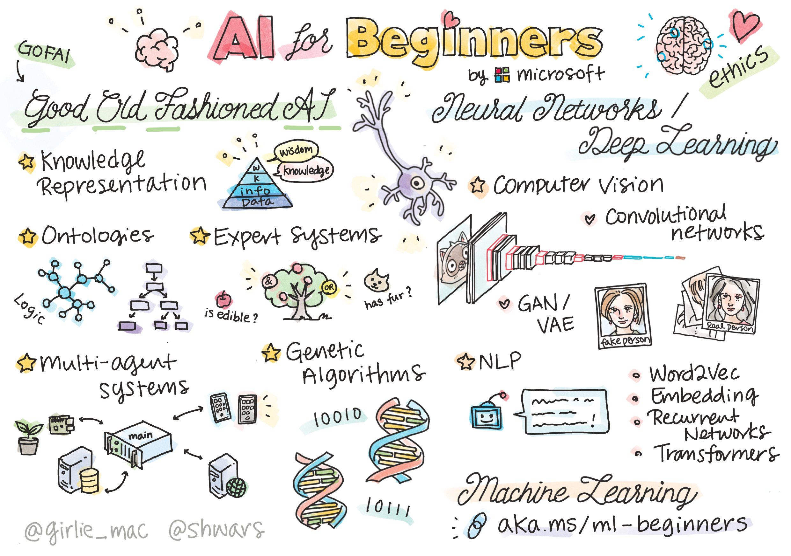

# CM0091 - Artificial Intelligence

Course Repository CM0091 Artificial Intelligence at Universidad EAFIT

| **INSTRUCTOR** | Juan David Martínez Vargas (jdmartinev@eafit.edu.co)   |
| -------------- | -------------------------------- |
| **LECTURES**   | Tuesday & Thursday 7:30 – 9:00, 15-103 |
| **MATERIAL**   | [2025 repo](https://github.com/jdmartinev/ArtificialIntelligenceIM/)  

> Sketchnote by [Tomomi Imura](https://twitter.com/girlie_mac)

## Roadmap of the course

**[Roadmap of the Course](/Lecture01/Roadmap.md)**

## We will learn in this course:

* **Neural Networks** and **Deep Learning**, which are at the core of modern AI. We will illustrate the concepts behind these important topics using code in two of the most popular frameworks - [TensorFlow](http://Tensorflow.org) and [PyTorch](http://pytorch.org).
* **Neural Architectures** for working with images and text. We will cover recent models but may be a bit lacking in the state-of-the-art.
* Less popular AI approaches, such as **Genetic Algorithms** and **Multi-Agent Systems**.
* Different approaches to Artificial Intelligence, including the "good old" symbolic approach with **Knowledge Representation** and reasoning ([GOFAI](https://en.wikipedia.org/wiki/Symbolic_artificial_intelligence)).

## Evaluation
| **Event** | Topic  |
| -------------- | -------------------------------- |
| **Quiz 1 (5%)** | Neural Network basics   |
| **Quiz 2 (5%)** | Computer vision   |
| **Quiz 3 (5%)** | Natural Language Processing  |
| **Quiz 4 (5%)** | AI approaches  |
| **Assignment 1 (15%)** | Fully connected nets and backpropagation  |
| **Assignment 2 (15%)** | Application of computer vision  |
| **Assignment 3 (15%)** | GPT2  |
| **Assignment 4 (15%)** | Multi-Agent Systems  |
| **Final project (20)** | AI applications  

# Resources:
* Computational resources: I strongly recommend creating (free) accounts on the following platforms:
  - [Google collaborative](https://colab.research.google.com/)
  - [HuggingFace](https://huggingface.co/)
  - [Kaggle](https://www.kaggle.com/)
  - [LightingAI](https://lightning.ai/)
  - [Weights and Biases](https://wandb.ai/site)
  
* Deep Learning books:
  - [Deep Learning](https://www.deeplearningbook.org/)
  - [Dive into Deep Learningas](https://d2l.ai/)
  - [Deep Learning - Foundations and Concepts](https://www.bishopbook.com/)
  - [Deep Learning with Python](https://github.com/fchollet/deep-learning-with-python-notebooks)

* Artificial Intelligence Books:
  - [Artificial Intelligence: A Modern Approach](https://aima.cs.berkeley.edu/)
  - [Artificial Intelligence with Python: A Comprehensive Guide to Building Intelligent Apps for Python Beginners and Developers](https://www.amazon.com/Artificial-Intelligence-Python-Comprehensive-Intelligent/dp/178646439X)

* Large Language Models:
  - [Building a Large Language Model from Scratch](https://www.manning.com/books/build-a-large-language-model-from-scratch)
 
* Online courses:
  - [Intro to Deep Learning](http://introtodeeplearning.com/)
  - [DeepMind Deep Learning course](https://www.youtube.com/watch?v=7R52wiUgxZI)
 
## Lectures
  
- [Lecture01 - Introduction to AI](/Lecture01/)

